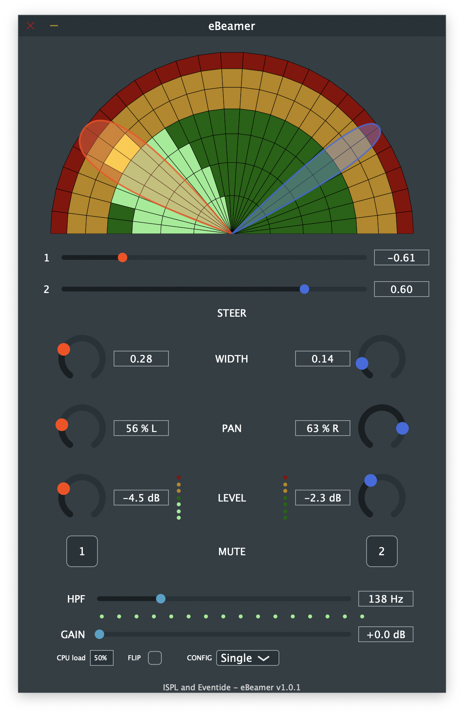

# eBeamer 
A JUCE-based VST3 plug-in and standalone application to support the [eStick](https://www.facebook.com/estickproject) project.

## Getting Started
- Just want to try out the VST or the app? Go the the [release](releases/) page.
- If you're not familiar with JUCE, [this](https://juce.com/learn) is a good place to start.
- If you're developing on Windows, download and extract the [ASIO ASK](https://www.steinberg.net/en/company/developers.html) in the *ASIO/* folder.

## Contributing
- Any contribution to the project is highly appreciated! Get in touch to know more.

## References
- [A Dante Powered Modular Microphone Array System](http://www.aes.org/e-lib/browse.cfm?elib=19743)

## Credits
- [Eventide Inc.](https://www.eventideaudio.com/)
- [Image and Sound Processing Lab](http://ispl.deib.polimi.it/), Politecnico di Milano